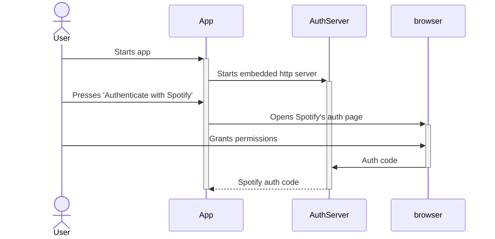

---
tags:
  - Kotlin
  - Compose
  - SpotifyMigrator
date: 2024-05-30
author: Kantis
title: OAuth with Compose Desktop
---
Yesterday I started a new project, [spotify-migrator](https://github.com/kantis/spotify-migrator), which I hope will provide plenty of new learning opportunities. 

The aim of the project is to create an application to help extract data from Spotify and move it into other music services (Apple Music first, since that's what I'm interested in trying out).

The first challenge I tackled with the project was to perform OAuth authentication against the Spotify API. OAuth is built around directing the user to a webpage where they can grant permissions to the application requesting them. If the user consents, the user is redirected back with an auth-code that can be consumed by the application to perform requests on the user's behalf.

![[Pasted image 20240530233442.png]]

For a desktop app, we typically don't involve any server. It's not immediately obvious where to redirect the user back to after consenting however.. How can we deal with that?

## Ktor to the rescue!
I decided to embed a Ktor server in the desktop application to handle the OAuth callback. Ktor is light-weight and easy to spin-up directly within the app, and we can terminate it once we're done with OAuth flows.

